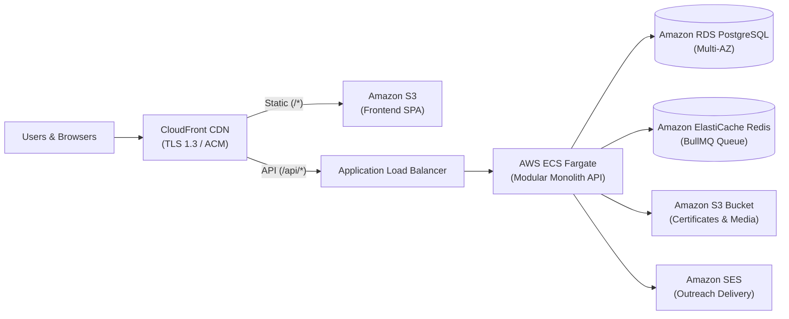

# EventOps — Community & Event Collaboration Platform (MVP)

> **Meetup helps people find events. EventOps helps communities and organizers discover each other, collaborate on events, request sponsorships/venues, and safely reach each other's audiences — without ever exposing private member data.**

---

## 💡 Core Innovation: Permission-Based Audience Outreach

In traditional platforms, co-promoting events requires sharing raw email lists or exporting CSVs, violating attendee privacy and GDPR regulations. 

**EventOps introduces Permission-Based Outreach:**
- **Zero PII Exposure**: Organizer A *never* sees Community B's member directory, emails, or personal identifiers.
- **Review Queue**: Organizer A submits a broadcast request specifying purpose, target audience, and message.
- **Community Control**: Community B's admin reviews, edits, or approves/rejects the request.
- **Platform Delivery Engine**: Upon approval, EventOps dispatches the broadcast asynchronously on the organizer's behalf.
- **Aggregated Analytics Only**: The requesting organizer only ever views aggregated campaign metrics (sent, delivered, opened, clicked, registered) — never individual recipient identities.

---

## 🚀 Key Feature Modules

| Module | Features & Capabilities |
|---|---|
| **🔐 Auth & Multi-Role RBAC** | JWT access (15m) & refresh (7d) tokens, bcrypt hashing, multiple simultaneous roles (`ORGANIZER`, `COMMUNITY_ADMIN`, `ATTENDEE`, `SPONSOR`, `VENUE_OWNER`, `PLATFORM_ADMIN`), profile interest tags. |
| **👥 Organizations & Communities** | Dual membership model: **Join** as an active member vs **Follow** for public updates. Member privacy isolation and verified community badges. |
| **🎟️ Events, QR Tickets & Certificates** | Lifecycle (`DRAFT` $\rightarrow$ `PUBLISHED` $\rightarrow$ `COMPLETED`). HMAC-SHA256 signed QR ticket generation, organizer check-in verification scanner, automatic tamper-proof certificate generation (`EO-CERT-...`), and public verification portal. |
| **🤝 Collaboration Marketplace** | Cross-organization event collaboration proposals (`CO_HOST`, `COMMUNITY_PARTNER`, `CROSS_PROMOTION`), counter-proposal negotiation threads, and shared workspace task boards. |
| **📢 Permission-Based Outreach** | Campaign request submission, community admin review queue, customizable intros, async BullMQ delivery, rate limiting (3/day for unverified orgs), and aggregate conversion tracking. |
| **💼 Sponsorship Marketplace & CRM** | Tiered sponsorship opportunity postings with budget filters, sponsor application tracking, and an interactive **6-Stage CRM Pipeline** (`potential` $\rightarrow$ `contacted` $\rightarrow$ `interested` $\rightarrow$ `negotiation` $\rightarrow$ `confirmed` $\rightarrow$ `completed`). |
| **🏛️ Venue Directory & Bookings** | Venue profiles with capacity and facility filtering (AV, projector, stage, WiFi, catering, parking), booking requests with counter-proposal workflows (`requested` $\rightarrow$ `countered` $\rightarrow$ `accepted`/`rejected`). |
| **📊 Dashboards & Audit Trail** | Real-time organizer performance metrics (attendance turnout rate, capacity utilization), community audience growth analytics, campaign ROI conversion tracking, and an immutable, tenant-scoped platform audit log. |
| **🐳 Production Containerization** | Multi-stage production Dockerfiles for API and Web (Vite + Nginx), production Docker Compose stack, GitHub Actions CI workflow, and AWS cloud deployment architecture. |

---

## 🛠️ Tech Stack

- **Monorepo**: npm workspaces (`packages/*`, `apps/*`)
- **Backend**: Node.js 20, TypeScript, Express (Modular Monolith architecture with strict domain boundaries)
- **Frontend**: React 18, TypeScript, Tailwind CSS, Vite, Lucide Icons
- **Shared Types**: `@eventops/shared-types` (Type-safe contracts, DTOs, and enums shared between API and Web)
- **Database & ORM**: PostgreSQL 16, Prisma ORM *(includes seamless dual-mode in-memory database fallback for zero-config local development and offline test execution)*
- **Cache & Queues**: Redis 7, BullMQ (async job processing and rate limiting)
- **Object Storage**: AWS S3 compatible (MinIO locally, Amazon S3 in production)
- **Email Service**: Nodemailer (Mailhog capture locally, Amazon SES in production)
- **Testing**: Jest, Supertest (8 test suites, 77 automated integration tests)
- **DevOps**: Docker, Docker Compose, Nginx Alpine, GitHub Actions

---

## 📁 Repository Structure

```
.
├── apps/
│   ├── api/                    # Express modular monolith backend
│   │   ├── prisma/             # Database schema (17 entities) & migrations
│   │   ├── src/
│   │   │   ├── config/         # Environment variables & service config
│   │   │   ├── core/           # Prisma, Redis, Logger, MemoryDb fallback
│   │   │   ├── middleware/     # Auth, RBAC, error handling, rate limiting
│   │   │   ├── modules/        # 10 domain modules (auth, events, outreach, etc.)
│   │   │   └── test/           # 8 Jest integration test suites (77 tests)
│   │   └── package.json
│   └── web/                    # React + Vite SPA frontend
│       ├── src/
│       │   ├── components/     # CollaborationTab, OutreachTab, SponsorshipTab,
│       │   │                   # VenuesTab, DashboardsTab
│       │   ├── App.tsx         # Main dashboard and navigation
│       │   └── main.tsx
│       └── package.json
├── packages/
│   └── shared-types/           # Shared models, DTOs, and enums
├── infra/
│   └── docker/
│       ├── Dockerfile.api      # Development API Dockerfile
│       ├── Dockerfile.api.prod # Production multi-stage API Dockerfile (non-root)
│       ├── Dockerfile.web      # Development Web Dockerfile
│       ├── Dockerfile.web.prod # Production multi-stage Web Dockerfile (Nginx)
│       ├── docker-compose.yml  # Local dev Compose stack
│       └── nginx.conf          # Production Nginx SPA routing & reverse proxy
├── docs/
│   ├── architecture.md         # Monorepo architecture & domain boundaries
│   ├── deployment.md           # AWS cloud production architecture (ECS/RDS/S3)
│   └── er-diagram.md           # Mermaid Entity-Relationship diagram
├── .github/
│   └── workflows/ci.yml        # GitHub Actions CI (build, test, docker build)
├── docker-compose.yml          # Root local dev Compose file
├── docker-compose.prod.yml     # Production reference Compose file
├── package.json                # Root monorepo workspace configuration
└── README.md
```

---

## ⚡ Quick Start

### Option 1: Local Development (Node.js)

Because EventOps features automatic dual-mode persistence, you can run the entire platform immediately on your host machine without needing local PostgreSQL or Redis installed.

```bash
# 1. Install dependencies
npm install

# 2. Build shared types and packages
npm run build

# 3. Start the Backend API (Port 4000)
npm run dev:api

# 4. In a separate terminal, start the Frontend Web UI (Port 3000)
npm run dev:web
```

- **Web UI**: [http://localhost:3000](http://localhost:3000)
- **API Base**: [http://localhost:4000/api](http://localhost:4000/api)
- **Health Check**: [http://localhost:4000/api/health](http://localhost:4000/api/health)

---

### Option 2: Full Local Stack with Docker Compose

To launch all backing infrastructure (PostgreSQL, Redis, MinIO S3, Mailhog email inbox, API, and Web):

```bash
# Start all services in the background
npm run docker:up

# Stream service logs
npm run docker:logs

# Tear down containers and volumes
npm run docker:down
```

#### Local Endpoints:
| Service | URL | Notes |
|---|---|---|
| **EventOps Frontend** | [http://localhost:3000](http://localhost:3000) | Vite React SPA |
| **EventOps API** | [http://localhost:4000/api](http://localhost:4000/api) | Express REST API |
| **API Health Probe** | [http://localhost:4000/api/health](http://localhost:4000/api/health) | Readiness / Liveness |
| **Mailhog Email Web UI** | [http://localhost:8025](http://localhost:8025) | Inspect captured outreach emails |
| **MinIO S3 Console** | [http://localhost:9001](http://localhost:9001) | User: `minioadmin` / Pass: `minioadmin` |
| **PostgreSQL 16** | `localhost:5432` | DB: `eventops`, User/Pass: `postgres` |
| **Redis 7** | `localhost:6379` | Task queue & token store |

---

### Option 3: Production Docker Compose (`docker-compose.prod.yml`)

To test the production multi-stage container builds with Nginx reverse proxying:

```bash
# Launch production containers
npm run docker:prod:up

# Tear down production containers
npm run docker:prod:down
```

- **Production App**: [http://localhost](http://localhost) (Port 80)

---

## 🧪 Automated Testing

EventOps has a comprehensive integration test suite covering all business logic, authorization boundaries, cryptographic signatures, and privacy restrictions.

```bash
# Run all test suites across workspaces
npm test

# Run API test suites directly
npm test --prefix apps/api
```

### Verified Test Suites:
- `health.test.ts` — Liveness & readiness probes
- `auth.test.ts` — Multi-role RBAC, bcrypt passwords, JWT issue/refresh
- `organizations.test.ts` — Communities, member privacy, verification toggle
- `events.test.ts` — Events CRUD, HMAC-SHA256 signed QR tickets, check-in, certificates
- `collaboration.test.ts` — Cross-org marketplace, proposals, task board & chat
- `outreach.test.ts` — Permission-based outreach, zero PII leak, rate limits
- `marketplaces.test.ts` — 6-stage sponsorship CRM & venue booking requests
- `dashboards.test.ts` — Organizer performance, community ROI, platform audit log

---

## ☁️ Production AWS Architecture

EventOps is architected to map cleanly to production AWS cloud services:



For full details on VPC subnet segmentation, security groups, zero-downtime rolling deployments, disaster recovery, and CloudWatch alarm thresholds, see [docs/deployment.md](docs/deployment.md).

---

## 📜 License

This project is developed as part of the EventOps MVP. All rights reserved.
