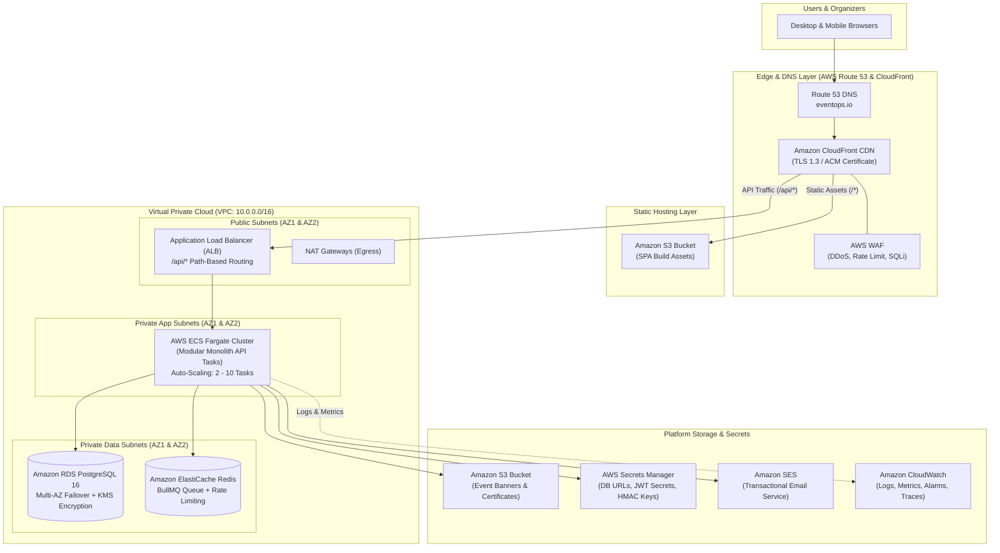
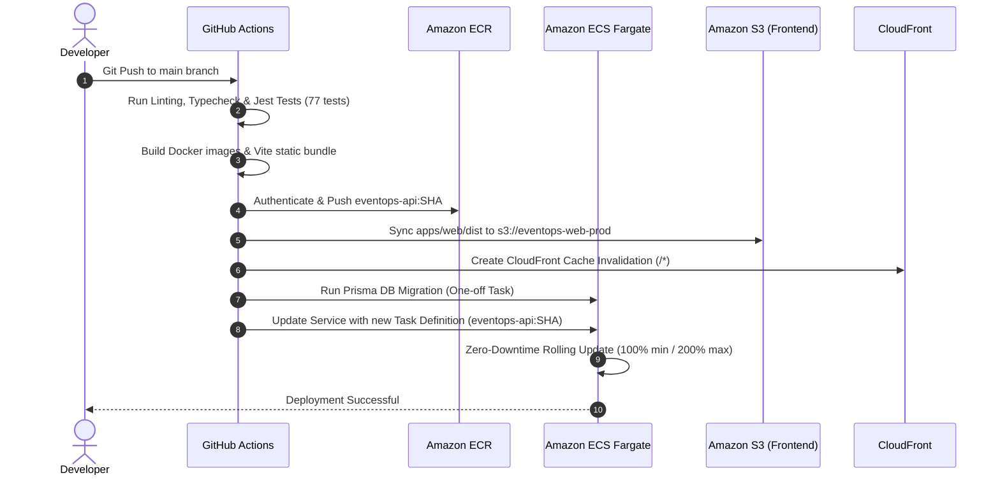

# EventOps — AWS Cloud Production Deployment Architecture

This document describes the production cloud architecture for EventOps, mapping the local containerized stack (`api`, `web`, `postgres`, `redis`, `minio`) to production-grade managed AWS infrastructure services.

> **Note**: As defined in the MVP specification, actual cloud provisioning via Terraform is scheduled for a subsequent phase. This reference architecture defines the production target topology, networking, CI/CD pipeline, and operational procedures.

---

## 1. High-Level Architecture Topology

---

## 2. AWS Service Mapping

| Local Component | AWS Production Service | Configuration & Sizing Rationale |
|---|---|---|
| **Frontend Web** (`apps/web`) | **Amazon S3 + CloudFront** | Vite-built static SPA deployed to an S3 bucket with Origin Access Control (OAC). CloudFront delivers global edge caching with sub-20ms latencies and zero compute server overhead. |
| **Backend API** (`apps/api`) | **AWS ECS on AWS Fargate** | Serverless container compute running the modular monolith. No EC2 instances to patch. Scaled across multi-AZ availability zones. |
| **Relational Database** (`postgres`) | **Amazon RDS PostgreSQL 16** | Multi-AZ deployment providing synchronous replication with automated failover. Automated daily snapshots + continuous WAL archiving for point-in-time recovery. |
| **Cache & Task Queue** (`redis`) | **Amazon ElastiCache for Redis** | Redis 7 replication group with multi-AZ enabled. Provides high-throughput queuing for BullMQ outreach delivery and token blocklists. |
| **Object Storage** (`minio`) | **Amazon S3** | Secure bucket for event promotional banners, sponsor logos, and HMAC-signed attendee certificates. Direct uploads use S3 Presigned URLs. |
| **Outbound Email** (`mailhog`) | **Amazon SES** | High-deliverability transactional email service with DKIM/SPF verification, handling permission-based outreach delivery. |
| **Secrets & Keys** (`.env`) | **AWS Secrets Manager** | Encrypted parameter store for `JWT_ACCESS_SECRET`, `JWT_REFRESH_SECRET`, `TICKET_SIGNING_SECRET`, and database connection strings with automated rotation. |

---

## 3. Network Architecture & Security

### VPC Layout
- **CIDR Block**: `10.0.0.0/16` spanning 2 Availability Zones (`us-east-1a`, `us-east-1b`).
- **Subnet Segmentation**:
  - **Public Subnets** (`10.0.1.0/24`, `10.0.2.0/24`): Houses Internet Gateways, NAT Gateways, and the public Application Load Balancer.
  - **Private Application Subnets** (`10.0.10.0/24`, `10.0.11.0/24`): Dedicated to ECS Fargate tasks. No public IPs assigned. Egress traffic routes through NAT Gateways.
  - **Private Data Subnets** (`10.0.20.0/24`, `10.0.21.0/24`): Isolated database and cache layer. No internet route. Accepts connections only from the ECS security group on port `5432` (Postgres) and `6379` (Redis).

### Security Boundaries & Non-Functional Compliance
1. **Network Firewalls (Security Groups)**:
   - ALB Security Group: Inbound `443` (HTTPS) from CloudFront managed prefix list only.
   - ECS Task Security Group: Inbound `4000` strictly from the ALB Security Group.
   - RDS Security Group: Inbound `5432` strictly from the ECS Task Security Group.
   - ElastiCache Security Group: Inbound `6379` strictly from the ECS Task Security Group.
2. **Data Encryption**:
   - **In-Transit**: TLS 1.3 enforced at CloudFront, ALB, and internal RDS connection pooling (`sslmode=require`).
   - **At-Rest**: AES-256 KMS customer-managed keys for RDS storage, ElastiCache encryption at rest, S3 server-side encryption (`SSE-KMS`), and CloudWatch log groups.
3. **Least-Privilege IAM Roles**:
   - `EventOpsTaskExecutionRole`: Grants permissions to pull images from Amazon ECR and retrieve secrets from Secrets Manager.
   - `EventOpsTaskRole`: Grants runtime permissions to interact with S3 (upload certificates) and SES (send outreach emails).

---

## 4. Continuous Integration & Deployment (CI/CD)

The automated deployment pipeline leverages GitHub Actions and Amazon ECR:

### Zero-Downtime Deployment Strategy
- **Rolling Update Settings**:
  - `minimumHealthyPercent`: `100%` (always at least 2 healthy tasks serving traffic during deployments).
  - `maximumPercent`: `200%` (spins up new container tasks before draining old versions).
- **Prisma Migrations**: Executed via an isolated, one-off ECS standalone task (`prisma migrate deploy`) prior to flipping traffic to the new image version, preventing database schema lock contention.

---

## 5. Scalability & Operational Observability

### Auto-Scaling Policies
- **Target Tracking Scaling**:
  - Target: **70% average CPU utilization** across ECS tasks.
  - Target: **1,000 active requests per target** on the ALB.
- **Scale-Out Cooldown**: 60 seconds.
- **Scale-In Cooldown**: 300 seconds (prevents flapping during traffic spikes).

### Monitoring & CloudWatch Alarms
| Metric | Threshold | Severity | Automated Action |
|---|---|---|---|
| **ALB 5xx Error Rate** | $> 1\%$ for 2 consecutive periods (5 min) | Critical | PagerDuty alert + automatic rollback |
| **P95 Latency** | $> 500\text{ ms}$ for 5 minutes | Warning | Trigger ECS task scale-out |
| **RDS CPU Utilization** | $> 80\%$ for 10 minutes | Warning | Alert DBA / trigger compute scaling |
| **Redis Memory Used** | $> 75\%$ | Warning | Eviction warning alert |
| **Dead Letter Queue (DLQ)** | $> 0$ unhandled outreach emails | High | Alert engineering team |

---

## 6. Disaster Recovery & Backup Plan

- **RTO (Recovery Time Objective)**: $< 15$ minutes.
- **RPO (Recovery Point Objective)**: $< 5$ minutes.
- **Automated RDS Backups**:
  - Daily automated snapshots retained for 35 days.
  - Continuous transaction log archiving allowing restore to any second within the retention window.
  - Cross-region snapshot copying enabled to secondary region (`us-west-2`).
- **S3 Versioning**: Enabled on all media and certificate buckets with lifecycle policies archiving objects older than 90 days to S3 Glacier Flexible Retrieval.
