# EventOps — Entity Relationship Diagram

This document describes the core data model and entity relationships for EventOps.

## Mermaid ER Diagram

```mermaid
erDiagram
    User ||--o{ Role : "holds"
    User ||--o{ OrganizationMember : "participates in"
    User ||--o{ CommunityFollower : "follows"
    User ||--o{ EventRegistration : "registers for"
    User ||--o{ AuditLog : "initiates"
    User ||--o{ OutreachRequest : "reviews"

    Organization ||--o{ Role : "scoped to"
    Organization ||--o{ OrganizationMember : "has members"
    Organization ||--o{ CommunityFollower : "has followers"
    Organization ||--o{ Event : "organizes"
    Organization ||--o{ Collaboration : "requests (sender)"
    Organization ||--o{ Collaboration : "receives (target)"
    Organization ||--o{ CollaborationMessage : "sends"
    Organization ||--o{ OutreachRequest : "submits"
    Organization ||--o{ OutreachRequest : "targeted community"
    Organization ||--o{ SponsorshipApplication : "applies as sponsor"
    Organization ||--o{ Venue : "owns"
    Organization ||--o{ VenueRequest : "requests venue"

    Event ||--o{ EventRegistration : "has attendees"
    Event ||--o{ Collaboration : "has collaborations"
    Event ||--o{ OutreachRequest : "promoted by"
    Event ||--o{ SponsorshipOpportunity : "offers"
    Event ||--o{ VenueRequest : "requests location"

    EventRegistration ||--o| Certificate : "earns upon attended"

    Collaboration ||--o{ CollaborationMessage : "contains thread"

    OutreachRequest ||--o| OutreachCampaign : "tracks aggregated metrics"

    SponsorshipOpportunity ||--o{ SponsorshipApplication : "receives"

    Venue ||--o{ VenueRequest : "booked via"

    User {
        uuid id PK
        string email UK
        string password_hash
        string name
        string_array interests
        string avatar_url
        datetime created_at
        datetime updated_at
    }

    Role {
        uuid id PK
        uuid user_id FK
        uuid org_id FK "nullable"
        RoleType role_type "attendee|organizer|community_admin|sponsor|venue_owner|platform_admin"
        datetime created_at
    }

    Organization {
        uuid id PK
        string name
        OrganizationType type "community|company|university|ngo"
        boolean verified
        string description
        string website
        datetime created_at
        datetime updated_at
    }

    OrganizationMember {
        uuid id PK
        uuid org_id FK
        uuid user_id FK
        OrgMemberRole role_in_org "member|moderator|admin|owner"
        datetime joined_at
    }

    CommunityFollower {
        uuid id PK
        uuid community_org_id FK
        uuid user_id FK
        datetime followed_at
    }

    Event {
        uuid id PK
        uuid organizer_org_id FK
        string title
        string description
        EventCategory category "tech|design|business|science|social|other"
        EventFormat format "online|offline"
        datetime start_date
        datetime end_date
        string location
        int capacity
        EventStatus status "draft|published|completed|cancelled"
        datetime created_at
        datetime updated_at
    }

    EventRegistration {
        uuid id PK
        uuid event_id FK
        uuid user_id FK
        string ticket_code UK
        RegistrationStatus status "registered|checked_in|attended"
        datetime registered_at
        datetime checked_in_at
    }

    Certificate {
        uuid id PK
        uuid registration_id FK,UK
        string verification_id UK
        datetime issued_at
    }

    Collaboration {
        uuid id PK
        uuid event_id FK
        uuid requesting_org_id FK
        uuid target_org_id FK
        CollaborationType collab_type "outreach|sponsorship|venue|speaker|media|technical|general"
        CollaborationStatus status "proposed|countered|accepted|rejected"
        datetime created_at
        datetime updated_at
    }

    CollaborationMessage {
        uuid id PK
        uuid collaboration_id FK
        uuid sender_org_id FK
        text body
        boolean is_counterproposal
        datetime created_at
    }

    OutreachRequest {
        uuid id PK
        uuid requesting_org_id FK
        uuid target_community_org_id FK
        uuid event_id FK
        text purpose
        text target_audience
        int requested_recipient_count
        string message_subject
        text message_body
        OutreachStatus status "pending|approved|rejected|needs_info"
        uuid reviewed_by_user_id FK
        datetime reviewed_at
        datetime created_at
        datetime updated_at
    }

    OutreachCampaign {
        uuid id PK
        uuid outreach_request_id FK,UK
        int sent_count
        int delivered_count
        int opened_count
        int clicked_count
        int registrations_count
        datetime created_at
        datetime updated_at
    }

    SponsorshipOpportunity {
        uuid id PK
        uuid event_id FK
        string title
        jsonb needs
        string budget_range
        datetime created_at
        datetime updated_at
    }

    SponsorshipApplication {
        uuid id PK
        uuid opportunity_id FK
        uuid sponsor_org_id FK
        SponsorshipStatus status "potential|contacted|interested|negotiation|confirmed|completed"
        text notes
        datetime created_at
        datetime updated_at
    }

    Venue {
        uuid id PK
        uuid owner_org_id FK
        string name
        int capacity
        jsonb facilities
        string city
        datetime created_at
        datetime updated_at
    }

    VenueRequest {
        uuid id PK
        uuid venue_id FK
        uuid event_id FK
        uuid requesting_org_id FK
        VenueRequestStatus status "requested|accepted|rejected|countered"
        datetime created_at
        datetime updated_at
    }

    AuditLog {
        uuid id PK
        uuid actor_user_id FK "nullable"
        string action
        string target_type
        string target_id
        jsonb metadata
        datetime created_at
    }
```

## Privacy & Boundary Invariant: Permission-Based Outreach
- **Strict Recipient Isolation**: `OutreachRequest` and `OutreachCampaign` tables never reference individual `User` IDs from the target community's `CommunityFollower` or `OrganizationMember` list.
- **Aggregated Metrics Only**: The requesting organization only has read access to `OutreachCampaign` counter totals (`sent_count`, `delivered_count`, `opened_count`, `clicked_count`, `registrations_count`).
- **Auditability**: Approval, rejection, and message dispatch triggers write to `AuditLog`.
